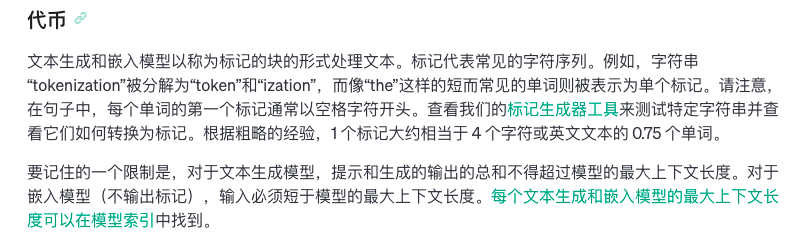
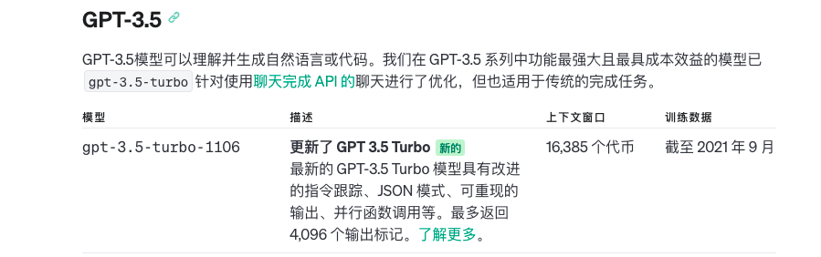

# openai-sdk-experiment

学习openai sdk，使用一些示例作为技术预研的依据。所有的示例都是基于openai3.5模型。

## 概述

- OpenAI SDK提供与OpenAI API官方文档相契合的函数，方便开发者使用。也可直接使用官方API进行调用。
- OpenAI SDK可以根据不同场景使用不同的能力，如：文本生成模型、助理、代币计算、嵌入。可以快速集成到应用程序。
- 此分享旨在对于OpenAI技术预研做个总结。
- 技术预研使用OpenAI SDK版本为v1.17.8，GPT模型使用的是GPT-3.5，文本生成模型使用gpt-3.5-turbo-1106

## 一、文本生成模型

OpenAI 的文本生成模型经过训练可以理解自然语言、代码和图像。这些模型提供文本输出来响应其输入。这些模型的输入也称为“提示”。设计提示本质上是如何“编程”大型语言模型，通常是通过提供说明或一些如何成功完成任务的示例。

模型gpt-3.5-turbo-1106的上下文限制16,385 个代币，指的是文本输入和文本输出的总数量不能超过16,385 个代币。最新的 GPT-3.5 Turbo 模型具有改进的指令跟踪、JSON 模式、可重现的输出、并行函数调用等。最多返回 4,096 个输出标记。

使用 OpenAI 的文本生成模型，您可以构建应用程序来实现如下能力：
- 文件草案
- 编写计算机代码
- 回答有关知识库的问题
- 分析文本
- 为软件提供自然语言界面
- 一系列科目的导师
- 翻译语言
- 模拟游戏角色

## 二、文字转语音

- 音频 API 提供speech基于我们的TTS（文本转语音）模型的端点。它带有 6 种内置声音，可用于：
  - 叙述一篇书面博客文章
  - 制作多种语言的语音音频
  - 使用流式传输提供实时音频输出
- 语音合成
  - tts-1,最新的文本转语音模型，针对速度进行了优化。
    - tts-1-hd（高清版）最新的文本转语音模型，针对质量进行了优化。
    
## 三、语音转文字

- 音频 API 提供两个语音转文本端点，transcriptions并且translations基于我们最先进的开源大型 v2 Whisper 模型。它们可用于：
  - 将音频转录成音频所使用的任何语言。
  - 将音频翻译并转录成英语（目前仅支持英文）。
  - 文件上传当前限制为 25 MB，并且支持以下输入文件类型：mp3、mp4、mpeg、mpga、m4a、wav和webm。

## 四、Assistants

### 1. Assistants原理

- 助手可以使用特定指定调用openAI的模型，以调整其个性和能力
- 助手可以并行访问多个工具，这些可以是openAI托管的工具，也可以是你构建的工具
- 助手可以访问持久线程。线程通过存储消息历史记录并在对话对于模型上下文长度来说太长时截断它来简化AI应用程序开发。您创建一个线程一次，然后只需要在用户回复时将消息附加到其中即可。
- 助理可以访问多种格式的文件，作为创建的一部分或作为助理和用户之间的线程的一部分。使用工具时，助理可以创建文件，并引用他们在创建的消息中引用的文件。

### 2. Assistants步骤
- 创建助手
- 创建线程
- 向线程添加消息
- 运行助手
- 检查运行状态
- 显示助理的响应

## 五、Tokens计算工具

- 这个主要是为文本生成模型服务的，用来计算文本的token长度，避免超长。可以在文本输入后，进行计算token长度，如果token超长直接提示错误，也节省了API调用的资源。
- tiktoken-go是官方提供的go库，其算法和官方文档一致，可在应用程序中使用。

### 1. 官方提供的页面工具

https://platform.openai.com/tokenizer


### 2. 官方提供的go库工具
https://github.com/pkoukk/tiktoken-go


[性能测试报告](https://github.com/pkoukk/tiktoken-go/blob/main/README_zh-hans.md)


## 六、遇到的问题

### 1. openai的api是否有token长度限制，长文本可以通过api调用实现吗?

根据不同模型，每个模型支持的最大token不一样，gpt-3.5-turbo-1106 模型的最大相应token是4096，这个设置max token值不能超4096。这个max token是gpt给你返回的内容所用的token。




所以，当超过限制是会超过的。

### 2. 助手中的函数调用，这个函数在哪里实现，openai是如何执行自定义的函数的？

在你应用程序里做。实际应用场景是通过调用open AI的API，调用时把你本地有的函数信息传过去，包含函数的功能描述、函数需要的参数等信息，gpt发现需要通过调用你提供的函数才能得到结果时，它会返回给你需要调用的函数和参数，你的应用程序就可以执行该函数，然后将执行结果发给gpt。

### 3. 为什么助手功能的函数调用的结果原样发送给AI，AI返回的结果与函数调用返回的结果不同？如何优化让其趋于一致？

AI会总结你文档的信息重新生成描述，所以不完全一致，你试试在函数说明里加一些提示限定，比如”不要修改函数的返回结果“

## 七、参考资料

- [openai官方文档](https://platform.openai.com/docs/introduction)
- [openai官方API文档](https://platform.openai.com/docs/api-reference)
- [openai sdk文档](https://github.com/sashabaranov/go-openai?tab=readme-ov-file)
- [openai sdk示例代码](https://github.com/likai1130/openai-sdk-experiment)
- [tokens计算方式](https://github.com/pkoukk/tiktoken-go#counting-tokens-for-chat-api-calls)
- [OpenAI开发者论坛](https://community.openai.com/)

## 八、使用说明

### 配置环境变量

```
OPENAI_KEY = XXX
```
